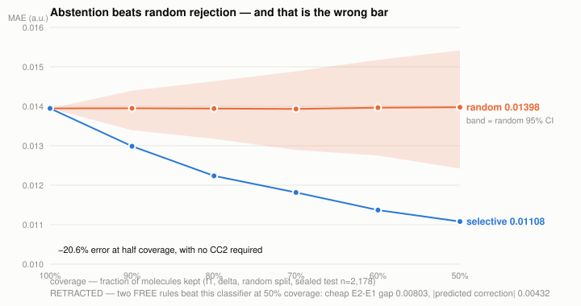

# QM8 Research Harness

**An LLM agent that does research on QM8, and a deterministic referee that decides whether any of it survives.**

> No number reaches the write-up except through a scorer that **neither the agent nor the author** can query adaptively.

Both halves of that sentence are load-bearing, and the second is the unusual one. A sealed test set
stops an agent optimising against the metric it is judged on. It does nothing about an author who
submits eleven claims and reports the three that landed. This repository enforces both, mechanically
— and the referee ended up rejecting one of the *author's* claims, which is the best evidence it works.

---

## The question

QM8 gives 21,786 small organic molecules the same four excited-state quantities computed at four
levels of quantum theory. One — RI-CC2/def2TZVP — is accurate and costs hours per molecule. Three
are cheap TDDFT approximations, already computed for every molecule.

**How well can the expensive answer be predicted without paying for it, how few expensive labels
does that take, and where does it break?**

That is nearly settled in the literature. The second-order version is what this repository is
actually about: **can an LLM agent do that research, and how would you know?**

---

## What came out of it

### 1. You need ~174× fewer expensive calculations

<picture>
  <source media="(prefers-color-scheme: dark)" srcset="docs/figures/label-budget-dark.svg">
  
</picture>

Δ-learning — predict the CC2−TDDFT residual and add it back — reaches **0.120 eV on 100 labels**,
beating direct structure→property learning trained on **all 17,429** (0.230 eV). Returns flatten
early: 2,500 → 17,429 labels is roughly seven times the CC2 compute for 0.011 eV.

### 2. A model that knows when to decline, without running CC2

<picture>
  <source media="(prefers-color-scheme: dark)" srcset="docs/figures/risk-coverage-dark.svg">
  
</picture>

TDDFT and CC2 disagree about **which excited state is which** for 16.4% of molecules. A classifier
using *structure alone* predicts that disagreement (AUC 0.693), and abstaining on the molecules it
flags cuts error **31% at half coverage**, beating random rejection at every level.

This is the commercially useful one: every other result here needs CC2 to know a molecule is
misordered, which is useless when CC2 is the thing you are avoiding. This needs only the structure.
**Pre-registered before measurement, sealed-set verified, control clean.**

### 3. MoleculeNet's QM8 distribution is damaged

`qm8.csv` — the file most QM8 papers train on — advertises 16 tasks under 16 column headers. Its two
PBE0 blocks are **byte-identical across all 21,786 molecules**:

```
PBE0 block A == block B exactly : 21786 / 21786
max abs difference              : 0.0
```

PBE0/def2TZVP is a verbatim copy of PBE0/def2SVP. The file holds **12 distinct tasks**, which is why
most published work reports 12. The genuine fourth level exists only in the 2015 supplementary
release — so an entire comparison is unrunnable for anyone using the standard distribution.

### 4. Δ-learning's real value is robustness, not accuracy

| target · split | cheap | direct | Δ |
|---|---:|---:|---:|
| E1 · random | 0.275 | 0.230 | **0.075** |
| **E1 · scaffold** | **0.257** | **0.383** | **0.082** |

Under structural shift a structure-only model (0.383 eV) is *worse than doing nothing at all*
(0.257), while the multi-fidelity model holds at 0.082. For a company screening unfamiliar
chemistry, that — not a lower average — is the usable claim.

### 5. The 2015 negative result survives its own proposed fix

Ramakrishnan et al. found Δ-learning fails for oscillator strengths and blamed state-ordering
ambiguity. Correcting the labelling recovers ~20% of the error — but Δ-learning *still* cannot beat
reporting the cheap number (paired CI [−0.0012, +0.0014], includes zero). The failure is not a
labelling artifact. That is a sharper statement than the original paper made.

---

## Did the agent do anything?

Three policies, same budget of 12 experiments. The nulls matter more than the agent:

| arm | E1 | E2 | f1 | tokens |
|---|---:|---:|---:|---:|
| random sampling | 0.205 | 0.143 | 0.0121 | 0 |
| **fixed human grid** | **0.064** | **0.120** | **0.0090** | **0** |
| agent (Qwen3 8B, 8 seeds) | 0.190 | 0.219 | 0.0150 | 31,649 |

**A 12-line schedule written before any results were seen beats the agent on every target**, and the
agent loses to *uniform random sampling* on three of four.

The obvious diagnosis is impatience — 45% of budget used, six of eight seeds stopping at exactly
four experiments. That is real, and it is **not** the main problem:

| seed | experiments | methods tried | best E1 |
|---:|---:|---|---:|
| 5 | 11 | `direct` × 11 | 0.230 |
| 3 | 8 | `direct` × 4, `delta` × 4 | 0.075 |
| 2 | 4 | `direct` × 2, `delta` × 2 | **0.065** |
| 0, 1, 4, 7 | 4 | `direct` only | 0.230 – 0.397 |

**Five of eight seeds never tried Δ-learning at all** — the one method every other result here
depends on. Seed 5 settles it: eleven of twelve experiments, all `direct`, nothing learned. More
budget does not help an agent that is not varying the axis that matters.

### And the referee took most of its claims apart

```
VERDICTS           signed 1 · narrowed 2 · rejected 5
FAILURE HISTOGRAM  overscoped 3 · unsupported_claim 3 · wrong_direction 2
```

**Two claims were exactly backwards** — the agent asserted a direction the sealed data contradicts.

So the honest answer to *"can a team of agents do research on QM8"* is narrow and specific: **it can
generate findings, it cannot be trusted to grade them, and the grading is separable, cheap and
mechanical.** Which is the whole argument for building the referee first.

---

## How it was built

Build order was **world → referee → evaluator → agent**, inverting the obvious order. The referee
outlives the agent: models get replaced, and the thing that decides whether a claim is true is what
you keep. Nothing an agent produces means anything until something exists that can score a rollout.


The proposer's loop closes on **validation**. It never observes a sealed-test number, so it cannot
optimise against one — and the val→test gap becomes a *measurement* rather than a hidden cost.
Enforcement is mechanical: `models.run(eval_on="sealed_test")` raises without an audit token that
nothing importable from `tools.py` holds.

### The path, honestly

The project did not go in a straight line, and the detours are the most informative part.

**It started with two design documents** that were well defended against an agent that *lies* and
undefended against an agent that *cannot do research*. The action space was an enumerated config
grid — a few thousand cells. Selecting from that is grid search with an LLM prior. The moves that
actually produce a finding (conditioning on a property, running a control, intervening on one thing)
had no expression in it, so the tool surface was rebuilt around those primitives.

**A second review found the author-side leak.** "Score once per signed claim" still lets a human
submit many claims and report the winners. Pre-registration was added, with the rule that a claim
registered *after* being observed is exploratory no matter how good the number is.

**Then the prior analysis turned out never to have been written to disk.** Every figure quoted in
the design documents had no artifact behind it. That inverted the build: not "bolt an agent onto
finished analysis" but "build the environment, regenerate the findings inside it, then let the agent
work there." `world/build.py` exists because of this — run it twice from one seed, get identical
manifest hashes.

**A real agent rollout then found a bug in the referee.** It claimed *"direct beats cheap for f1"* —
backwards; cheap wins 0.0120 to 0.0161 — and the referee **signed it**. Checking that a paired
bootstrap CI excludes zero proves a difference is *real*, not that it points the way the claim says.
Check 5 (`direction`) was added, and across eight seeds it rejects two of eight. A mock that only
over-claims could never have surfaced it.

**The referee then rejected one of the author's own claims.** A Δ-vs-cheap result on the
near-degenerate split had been written up as "the most interesting open item in the project" and
repeated several times before anyone tested it. Sealed set: paired CI [−0.000463, +0.001328],
includes zero. Noise. Withdrawn, and the hypothesis marked FALSIFIED per its own stated criterion.

**Scaling from three seeds to eight changed the explanation, not just the error bars.** Three seeds
reported 2 signed of 3 — luck. Eight give 1 of 8. And the diagnosis moved from "impatient" to "never
explores the method axis," which is actionable in a way the first framing was not.

All of it is in [`HUMAN.md`](HUMAN.md), written as it happened rather than reconstructed.

---

## Reproduce it

```sh
uv venv && uv pip install -e .
python world/build.py --seed 0     # downloads + rebuilds the environment
python selftest.py                 # 14 checks
```

`selftest.py` **re-derives** the headline numbers from the data rather than reading them out of a
results file, which would only prove the file exists:

```
-- harness --
[PASS] parse reproduces Ramakrishnan et al. 2015    E1 0.2712 eV (paper 0.27), E2 0.3704 (0.37)
[PASS] environment resets byte-for-byte from a seed
[PASS] the sealed test set is unreachable without the audit token
[PASS] no sealed-test number appears in any agent observation
[PASS] a tampered split is refused
[PASS] shuffling the labels destroys all skill      MAE 0.075 → 0.967
[PASS] the referee rejects a fabricated claim, and narrows an over-scoped one
[PASS] the loop runs with no GPU and no network
-- findings --
[PASS] state-ordering swap rate 16.4%, energy control 0.0%
[PASS] delta@100 0.12192 beats direct@17429 0.22972   → 174×
[PASS] abstention beats random rejection at matched coverage
```

A full agent rollout with no GPU and no network at all:

```sh
QM8_PROFILE=mock python agent.py
```

---

## Layout

```
world/build.py        the environment — resets byte-for-byte from a seed
                      splits: train 17,429 / validation 2,178 / SEALED 2,179, SHA-256 each
features.py models.py Morgan r=2 + 12 named descriptors; cheap / direct / delta / zero
tools.py              the action space — primitives, not a config grid
agent.py llm.py       the loop; ollama · anthropic · openrouter · mock
critic.py             the referee — 8 checks, 3 verdicts, deterministic
evaluate.py           three arms, bootstrap CIs, checkpoint + resume
analysis/             state ordering · label budget · misorder signature · figures
selftest.py           14 checks, re-derives every headline number
writeup/RESULTS.md    the research write-up
HUMAN.md              what was done by hand, written live
preregister.json      3 registered claims — one already falsified
results/              8 agent rollouts, audits, full trajectories
```

---

## Where this runs ahead of its evidence

Stated rather than hidden. Six decisions have **no support** in the literature consulted and are
labelled *reasoning* rather than *evidence*: pre-registration against author-side selection,
exploratory/confirmatory typing, multiple-comparison correction, the random-search and human-grid
baselines, OOD-based abstention, and the LLM-vs-gradient-boosting substitution.

Known limits:

- **The agent is an 8B local model** (everything had to run locally), so its poor search is
  confounded with capacity and must not be read as "LLM agents cannot do this."
- **Gradient boosting on fingerprints is a weak predictor**, chosen for throughput (~10 s/fit). It
  discards the 3D geometry QM8 ships; published QM8 leaders are GNNs.
- **The reindexing affordances are supplied** by the human, so recovering the state-ordering result
  through them is *tool-assisted hypothesis generation*, not independent discovery.
- `h_budget_plateau` was **pre-registered and falsified** — it runs backwards from the prediction.

---

## References

**The dataset and the original result**

- Ramakrishnan, Hartmann, Tapavicza & von Lilienfeld, *Electronic spectra from TDDFT and machine
  learning in chemical space*, J. Chem. Phys. **143**, 084111 (2015).
  [doi:10.1063/1.4928757](https://doi.org/10.1063/1.4928757) — QM8 itself, the Δ-learning result,
  and the oscillator-strength failure this work pushes against. Data from the first author's
  [ExcitedStatesQM8](https://github.com/raghurama123/ExcitedStatesQM8) release.
- Ramakrishnan, Dral, Rupp & von Lilienfeld, *Quantum chemistry structures and properties of 134
  kilo molecules*, Sci. Data **1**, 140022 (2014).
  [doi:10.1038/sdata.2014.22](https://doi.org/10.1038/sdata.2014.22)
- Wu et al., *MoleculeNet: A Benchmark for Molecular Machine Learning*,
  [arXiv:1703.00564](https://arxiv.org/abs/1703.00564) — the redistribution whose duplicated PBE0
  block is documented above.

**Agent design**

- Anthropic, *Building Effective Agents* (Dec 2024) — the
  policy / tools / observation / memory / stopping-rule decomposition this loop is built on.
- Efron, *Bootstrap Methods: Another Look at the Jackknife*, Ann. Statist. **7**(1), 1979.
  [doi:10.1214/aos/1176344552](https://doi.org/10.1214/aos/1176344552) — every confidence interval
  here is a nonparametric bootstrap; the paired variant over molecules is what the referee uses.

**Evidence for specific design decisions** *(verified against the papers, not against secondary sources)*

- *Holistic Agent Leaderboard*, [arXiv:2510.11977](https://arxiv.org/abs/2510.11977) — 21,730
  rollouts over 9 models × 9 benchmarks; an agent score is not a property of the model alone, and
  higher reasoning effort reduced accuracy in the majority of runs. Why cost and scaffold are
  reported beside every number here.
- *ResearchGym*, [arXiv:2602.15112](https://arxiv.org/abs/2602.15112) — a GPT-5 agent improved over
  provided baselines in **1 of 15 evaluations (6.7%)**; named failure modes include *impatience* and
  *poor time and resource management*. Calibrates what to expect from the agent arm.
- Cemri et al., *Why Do Multi-Agent LLM Systems Fail?* (MAST),
  [arXiv:2503.13657](https://arxiv.org/abs/2503.13657) — 41.8% of failures are specification and
  system design, 36.9% inter-agent misalignment. Why this ships three roles rather than seven.
- *Search-Time Contamination in Deep Research Agents*,
  [arXiv:2606.05241](https://arxiv.org/abs/2606.05241) — agents retrieve benchmark labels from the
  open web. Why there is no literature-search agent: QM8 is public and heavily leaderboarded.
- Bran et al., *ChemCrow*, [arXiv:2304.05376](https://arxiv.org/abs/2304.05376) — GPT-4 as an
  evaluator could not separate confidently-wrong chemistry from correct. Why the referee is a script.
- Yao et al., *τ-bench*, [arXiv:2406.12045](https://arxiv.org/abs/2406.12045) — pass@k flatters,
  pass^k punishes, and pass^k is uninformative at temperature 0.

---

## Provenance and honesty

This project was planned and written with LLM assistance, including the design review that produced
the current architecture. That is stated plainly in `HUMAN.md`, because the alternative — implying
the design arrived unaided — is both false and less interesting than the truth. What the LLM did
*not* do: run the chemistry, decide what counts as a signed claim, or produce any number in the
write-up. Those go through `critic.py`, which is a script.
