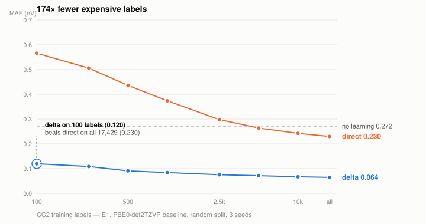
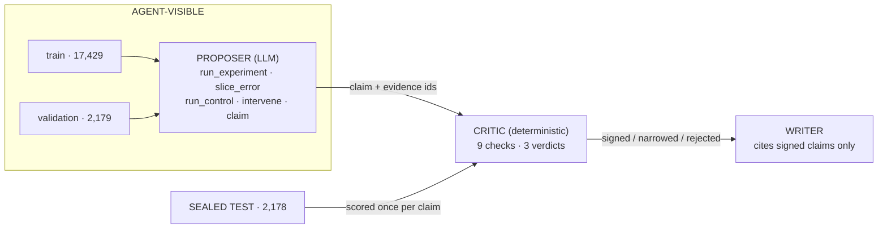

# QM8 Research Harness

**An LLM agent that does research on QM8, a deterministic referee that decides whether any of it survives, and a record of the referee winning four times — including against this project's own flagship result.**

> No number reaches the write-up except through a scorer that **neither the agent nor the author** can query adaptively.

---

## Start here: every headline claim this project published failed the same way

Not four different mistakes. **One mistake, four times** — report the slice where the effect appears, omit the slices where it does not.

| claim | slice reported | slice omitted | outcome |
|---|---|---|---|
| Abstention on f1 — *pre-registered, sealed-signed* | validation | sealed | **retracted** — magnitude artifact |
| Abstention on E1 — *proposed as the rescue* | validation | sealed | **retracted** — a free rule wins |
| Δ wins on screening metrics | f≥0.05, f≥0.1 | **f≥0.01, where it loses** | **qualified** |
| Δ survives shift, direct does not | scaffold/E1 | **the other 7 cells** | **1 of 8 survives** |

The second row matters most. An external audit caught the first error — a validation number printed four lines above the words *"sealed-set verified"* — and proposed E1 as the claim that survived. **The rescue was itself a validation number.** On the sealed set the ordering reverses:

```
E1 on validation  : classifier 0.05167   free gap rule 0.05728   -> classifier wins
E1 on sealed_test : classifier 0.05953   free gap rule 0.05686   -> classifier LOSES
```

Two authors, one week, the same error — the second while actively auditing for exactly that error. That is the finding. The val→test gap and threshold selection are not carelessness; they survive people hunting for them, which is why the check has to be mechanical rather than procedural.

**This repository is the machinery that caught all four, plus the record of it doing so.**

---

## What survives

Everything below is on the **sealed test set**, with paired bootstrap intervals over molecules.

### The state-ordering effect is real; the model built on it was not

TDDFT and CC2 disagree about which excited state is which for **16.4%** of molecules (12.1% / 11.8% at the other two cheap levels). The control is clean: the identical test on **energies** — sorted by construction — gives a **0.0%** swap rate and 0.00% gain, so this is not an artifact of reshuffling correlated columns.

A structure-only classifier does predict that disagreement (AUC 0.693) and abstaining on it does beat random rejection. It is still retracted, because beating random is the wrong bar:

| risk rule for f1, 50% coverage | selective MAE | cost |
|---|---:|---|
| the pre-registered classifier | 0.011080 | 1036 features, trained |
| cheap E2−E1 gap threshold | 0.008034 | **free** |
| \|predicted correction\| from the fitted Δ model | **0.004321** | **free — already computed** |
| oracle \|error\| | 0.001894 | ceiling |
| random rejection | 0.013954 | CI [0.012426, 0.015482] |

Two **free** rules beat it, one of which `models.py` already computes. Under magnitude stratification — keep the lowest-risk half *within* each \|f1\| quintile — it scores 0.012587 against a null of [0.012460, 0.015424]: **inside**. Spearman(risk, f1) = **+0.383**: it learned that bright molecules are risky. At 50% coverage it keeps **89 of 266** genuinely bright molecules where random rejection keeps **133 [117, 148]**. For a photophysics screen, it abstains on the hits.

### `delta_log`: the one model that beats the free baseline on ranking

Under MAE, reporting the cheap TDDFT number beats Δ-learning for oscillator strengths — the 2015 negative result, reproduced. But MAE is not what a screening campaign optimises. The mechanism, on sealed f1:

| Spearman | cheap | delta | **delta_log** |
|---|---:|---:|---:|
| bright (n=677) | 0.595 | **0.773** | 0.648 |
| dark (n=1501) | 0.820 | 0.403 | **0.847** |
| **all** | 0.846 | 0.681 | **0.888** |

Δ improves the ranking among bright transitions and **wrecks** it among the dark bulk — the GBM regresses a near-zero population to the mean and destroys an ordering the cheap method already had for free. That is why the screening result inverts with threshold: above f≥0.05 you see only the bright gain; at f≥0.01 the dark damage dominates.

Fitting the correction in **log space** repairs it. `delta_log` is the only model here that beats raw TDDFT on global ranking — f1 **+0.042** [0.031, 0.054], f2 **+0.050** [0.034, 0.067]. Four lines. Its MAE is much worse, so it is a ranking model and is reported as one. Exploratory: it was not pre-registered and cannot become confirmatory now.

### Δ-learning's advantage is narrower than published

Five methods × two splits × four targets, sealed, `delta − direct_aug` paired:

```
delta significantly beats direct_aug : 1/8   (scaffold/E1 only)
direct_aug significantly beats delta : 5/8
ties                                 : 2/8
```

`direct_aug` is plain direct learning *given the same cheap TDDFT columns*. The published claim — "a structure-only model is worse than doing nothing, and Δ is the only one that survives distribution shift" — generalised from **scaffold/E1, the single cell where it holds**. Most of the apparent multi-fidelity advantage was input access, not the Δ construction.

What survives is worth keeping and is stated narrowly: **under scaffold shift on E1, Δ beats a model given the same cheap numbers**, CI [−0.0117, −0.0056]. That is a claim about the construction.

### MoleculeNet's QM8 distribution is damaged

`qm8.csv` advertises 16 tasks under 16 column headers. Its two PBE0 blocks are **byte-identical across all 21,786 molecules** — PBE0/def2TZVP is a verbatim copy of PBE0/def2SVP, so the file holds **12 distinct tasks**. This was [reported to DeepChem in 2021](https://github.com/deepchem/deepchem/issues/2747) and is still present. The genuine fourth level exists only in the 2015 supplementary release.

### Label efficiency, stated honestly

<picture>
  <source media="(prefers-color-scheme: dark)" srcset="docs/figures/label-budget-dark.svg">
  
</picture>

Δ-learning on 100 CC2 labels beats *plain* `direct` trained on all 17,429. **The 174× is left-censored** — the sweep starts at 100, so the reported factor is literally `17429/100` and the true crossing lies below the grid's first point. Against `direct_aug` the gap closes almost entirely. The honest physical content is that **the cheap level carries a large constant offset**, and correcting it is worth more than thousands of fingerprint labels.

---

## The referee



The proposer's loop closes on **validation**; it never observes a sealed-test number. Enforcement is mechanical — `models.run(eval_on="sealed_test")` raises without an audit token that nothing importable from `tools.py` holds.

Nine checks. The ones added *because of* this audit are marked:

| check | catches |
|---|---|
| split hash · evidence resolves · sealed re-run | fabrication, leakage, precision mismatch |
| noise floor — paired bootstrap over molecules | noise reported as signal |
| direction | a claim that is exactly backwards |
| multiplicity — Holm over the confirmatory family | best-of-N |
| scope | a quantifier wider than the evidence |
| control | an artifact presented as a mechanism |
| **free baselines** ← *new* | **features that bought nothing** |
| **magnitude control** ← *new* | **a rule that never ranked error** |

The last two retracted the flagship. They exist because the audit showed that "beats random rejection" is a bar almost anything clears.

### On the agent

Eight seeds, budget 12, local Qwen3 8B, hash-bound traces:

```
3 of 8 seeds tried delta-learning at all      mean 5.4 of 12 experiments used
verdicts: 2 signed · 1 narrowed · 5 rejected  (3 of them wrong_direction)
```

The agent loses to a pre-written 12-line schedule on every target. Two of its claims pointed the wrong way — caught only by the `direction` check, which exists because an earlier rollout produced exactly that and an earlier referee **signed it**.

Honest caveat: the previously published `1 signed / 2 narrowed / 5 rejected` **cannot be re-derived** — its trace files are gone. The line above is from clean, hash-verified traces under the corrected referee. Two verdicts moved because of referee bugs rather than agent merit: the prompt told the agent to omit axes it wasn't claiming about and the referee then rejected it for omitting them; and citing *extra* supporting evidence made a claim score *worse*.

---

## Reproduce it

```sh
uv venv && uv pip install -e .
python world/build.py --seed 0     # rebuild the environment from a seed
python selftest.py                 # 18 checks
```

`selftest` **re-derives** the headline numbers rather than reading them from a results file. One check now asserts the **retraction** — it fails if the classifier ever beats every free baseline again. The old version certified the claim, on validation; the guard shared the claim's blind spot.

```sh
QM8_PROFILE=mock python agent.py   # a full rollout, no GPU, no network
```

---

## Layout

```
world/build.py        the environment — resets byte-for-byte from a seed
                      train 17,429 / validation 2,179 / SEALED 2,178, SHA-256 each
models.py             cheap / direct / direct_aug / delta / zero
tools.py agent.py     the action space and the loop
critic.py             the referee — 9 checks, 3 verdicts, deterministic
evaluate.py           three arms, bootstrap CIs, hash-bound traces, resume
analysis/             state ordering · label budget · abstention battery ·
                      screening metrics · method comparison · figures
selftest.py           18 checks, re-derives every headline number
writeup/RESULTS.md    the full write-up
docs/AUDIT_RESPONSE.md what the audit found and what was done about it
HUMAN.md              what was done by hand, written live
results/              8 rollouts, audits, batteries, full trajectories
```

---

## Honest limits

- **The agent is an 8B local model** (everything had to run locally), so its poor search is confounded with capacity.
- **Gradient boosting on fingerprints is weak** — it discards the 3D geometry QM8 ships. Published QM8 leaders are GNNs.
- **`delta_log` is exploratory.** It was not pre-registered, and this project now has four demonstrations of why that distinction matters.
- **The traces are tool results, not full transcripts** — they do not contain the model's own tokens.
- Two pre-registered hypotheses were **falsified**: `h_budget_plateau` runs backwards from its prediction, and `h_misorder_signature` is retracted above.

---

## References

**Dataset and the original result**

- Ramakrishnan, Hartmann, Tapavicza & von Lilienfeld, *Electronic spectra from TDDFT and machine learning in chemical space*, J. Chem. Phys. **143**, 084111 (2015). [doi:10.1063/1.4928757](https://doi.org/10.1063/1.4928757) — QM8, the Δ-learning result, and the oscillator-strength failure this work pushes against. Data from the first author's [ExcitedStatesQM8](https://github.com/raghurama123/ExcitedStatesQM8).
- Ramakrishnan, Dral, Rupp & von Lilienfeld, *Quantum chemistry structures and properties of 134 kilo molecules*, Sci. Data **1**, 140022 (2014). [doi:10.1038/sdata.2014.22](https://doi.org/10.1038/sdata.2014.22)
- Wu et al., *MoleculeNet*, [arXiv:1703.00564](https://arxiv.org/abs/1703.00564); duplication [reported 2021](https://github.com/deepchem/deepchem/issues/2747).

**Method**

- Anthropic, *Building Effective Agents* (Dec 2024) — the policy / tools / observation / memory / stopping-rule decomposition.
- Efron, *Bootstrap Methods: Another Look at the Jackknife*, Ann. Statist. **7**(1), 1979. [doi:10.1214/aos/1176344552](https://doi.org/10.1214/aos/1176344552) — every interval here, including the paired variant over molecules.
- El-Yaniv & Wiener, *On the Foundations of Noise-free Selective Classification*, JMLR **11** (2010) — risk–coverage curves, and why random rejection at matched coverage is the only honest baseline.

**Evidence for design decisions** *(verified against the papers)*

- *Holistic Agent Leaderboard*, [arXiv:2510.11977](https://arxiv.org/abs/2510.11977) — 21,730 rollouts; a score is not a property of the model alone, and higher reasoning effort reduced accuracy in the majority of runs.
- *ResearchGym*, [arXiv:2602.15112](https://arxiv.org/abs/2602.15112) — a GPT-5 agent improved over baselines in 1 of 15 evaluations; named failure modes include impatience and poor resource management.
- Cemri et al., *Why Do Multi-Agent LLM Systems Fail?*, [arXiv:2503.13657](https://arxiv.org/abs/2503.13657) — why this ships three roles, not seven.
- *Search-Time Contamination in Deep Research Agents*, [arXiv:2606.05241](https://arxiv.org/abs/2606.05241) — why there is no literature-search agent.
- Bran et al., *ChemCrow*, [arXiv:2304.05376](https://arxiv.org/abs/2304.05376) — GPT-4 could not separate confidently-wrong chemistry from correct. Why the referee is a script.
- Yao et al., *τ-bench*, [arXiv:2406.12045](https://arxiv.org/abs/2406.12045) — pass^k, and why it is uninformative at temperature 0.

---

## Provenance

Planned and written with LLM assistance, including the design review that produced this architecture and the audit that retracted its flagship. Stated plainly because the alternative is both false and less interesting. What the LLM did *not* do: run the chemistry, decide what counts as a signed claim, or produce any number here. Those go through `critic.py`, which is a script.

`HUMAN.md` is the running log, written as it happened — including every one of the retractions above.
